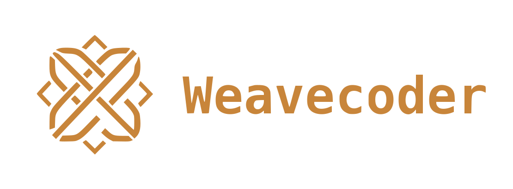

<div align="center">



# Weavecoder

[](LICENSE)
[](https://github.com/nicolasramos-es/weavecoder/releases)

A **Rust** coding-agent CLI with a native **Agent Swarm** for multiple fast parallel requests, prioritizing local models, and an embedded **Code Knowledge Graph** (tree-sitter) that indexes your entire project codebase.

</div>

## Features

- **Agent Swarm** — multiple requests in parallel, natively orchestrated
- **Local models first** — Ollama, LM Studio, oMLX/llama.cpp, or any OpenAI-compatible endpoint
- **Code Knowledge Graph (CKG)** — indexes code symbols and relationships with tree-sitter:
  - `wvc init` — scans the project, extracts functions/classes/imports/calls, and stores them in SQLite + FTS5
  - `wvc code-search <query>` — hybrid search (FTS5 + embeddings + dependency graph)
  - Graph traversal: "who calls X", "what does Y depend on"
  - Incremental indexing: only re-indexes modified files
- **Local embeddings** (all-MiniLM-L6-v2) for semantic search by meaning

## Installation

The installer scripts are always fetched from the project repository on GitHub — the single source of truth — never from any web domain.

### macOS & Linux

```bash
curl -fsSL https://raw.githubusercontent.com/nicolasramos-es/weavecoder/main/install.sh | bash
```

### Windows 11 (PowerShell 5.1+)

```powershell
irm https://raw.githubusercontent.com/nicolasramos-es/weavecoder/main/install.ps1 | iex
```

> The installer verifies the **SHA-256 checksum** of the binary against the digest published in the release and aborts with a clear error if they don't match. If the repository is private, export `GITHUB_TOKEN` (or `WVC_GITHUB_TOKEN`) before running it.

Need Homebrew, source builds, provider setup, or want an agent to set it up for you? Keep reading — [Quick Start](#quick-start) and [From source](#from-source).

### From source

```bash
git clone https://github.com/nicolasramos-es/weavecoder.git
cd weavecoder
cargo build --release --bin wvc
# → target/release/wvc
```

## Quick Start

```bash
# 1. Connect a local model (e.g. Ollama)
brew install ollama && ollama pull llama3.2
wvc login --provider ollama

# 2. Chat with the agent
wvc --provider ollama --model llama3.2 run 'hello'

# 3. Index a project and search it with the Code Knowledge Graph
wvc init /path/to/project --db ckg.db
wvc code-search "parseConfig" --db ckg.db
```

## Architecture

| Crate | Responsibility |
|---|---|
| `wvc-code-graph` | Code Knowledge Graph: tree-sitter (Go/Py/TS/Rust), SQLite+FTS5, embeddings, petgraph graph, hybrid search |
| `wvc-embedding` | Local embeddings (all-MiniLM-L6-v2, tract-onnx) |
| `wvc-swarm-core` | Agent swarm orchestration |
| `wvc-app-core` | Agent core (tools, sessions, server) |

## License

MIT — see [LICENSE](LICENSE).

This project builds on the exceptional work of [Jeremy Huang](https://github.com/nicolasramos/weavecoder) (wvc, MIT), on top of which we've added new features and improved the product. The original copyright notice is preserved in full in LICENSE.
